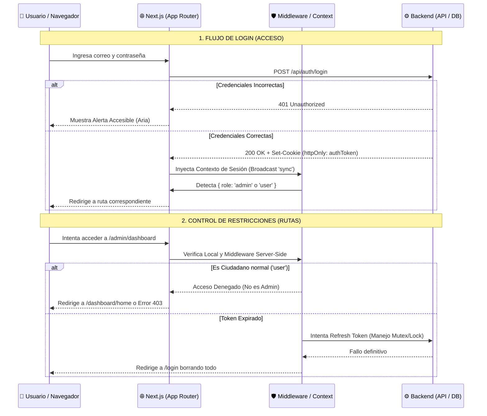

# Arquitectura y Diseño Técnico: Autenticación, Roles y Permisos
**Proyecto:** UrbanPulse  
**Módulo:** Seguridad y Autenticación  
**Fase:** Diseño y Definición (Sin Programación)

---

## 👥 1. Tipos de Usuarios, Roles y Permisos

Para aislar funcionalidades de forma segura, se han abstraído **2 grandes Roles** de interacción con la plataforma de reporte ciudadano:

| Rol | Descripción del Usuario | Permisos Específicos (ACL) |
| :--- | :--- | :--- |
| **`USER` (Ciudadano)** | Habitante que utiliza la aplicación para registrar incidentes públicos. | - Hacer Login/Logout seguro. - Leer listado de reportes públicos. - Crear nuevos reportes de incidentes. - Ver su propio perfil y progreso. |
| **`ADMIN` (Ayuntamiento)** | Funcionario municipal encargado de revisar, descartar y solucionar reportes. | - Hacer Login/Logout seguro. - Acceder al **Panel de Moderación**. - Cambiar el Estado de cualquier reporte (Ej: "En Progreso", "Resuelto"). - Suspender usuarios o banear IPs. |

---

## 🔄 2. Flujo Completo de Autenticación

El diseño a implementar utiliza una estructura robusta basada en Tokens de Sesión guardados en **Cookies Seguras**. A continuación el diagrama técnico de la arquitectura:

---

## 🏛️ 3. Documento de Decisiones Técnicas (Justificación)

### ¿Por qué elegimos este enfoque?
1. **Delegación a Cookies (Http-Only y SameSite: Lax):** En lugar de almacenar el JSON Web Token (JWT) en el `localStorage`, como hacen muchos tutoriales básicos, decidimos que el Backend (las API API routes de Next.js) nos inyecte un `Set-Cookie`.
2. **Refresh Tokens Silenciosos vía Interceptor / BroadcastChannel:** Hemos diseñado un AuthProvider global con un mecanismo de bloqueo (*Mutex*) en `fetchApi`. Esto previene tormentas de recargas al caducar la sesión y asegura una experiencia fluida.

### ¿Qué riesgos críticos se mitigan con este diseño?
*   **Ataques XSS (Cross-Site Scripting):** Al no haber acceso a `.cookie` desde JavaScript (gracias al flag `httpOnly`), incluso si un código malicioso inyectara un script al frontend, el atacante no puede robar el JWT de la víctima.
*   **Ataques CSRF (Cross-Site Request Forgery):** Controlado gracias a que las Cookies están blindadas bajo las políticas de Dominio `SameSite`.
*   **Secuestro de Sesión Cruzada ("Ghost Sessions"):** Mitigado por el `BroadcastChannel`. Si cierras sesión en una pestaña de Chrome, nuestro Event Listener empuja iterativamente a todas las otras pestañas de UrbanPulse forzandolas a destruir el AuthProvider y volcar al usuario a la pantalla de `/login` al instante.
*   **Escalamiento de Privilegios (IDOR / Bypasses):** Por diseño, la aplicación no confía únicamente en la ocultación de enlaces HTML (Ej: Ocultar el botón "Panel Admin"). Las peticiones críticas cruzan un *Middleware de servidor* de Next.js que lee pasivamente la cookie; si tu rol empotrado a en la firma del hash no arroja "Admin", la sub-ruta muere de raíz, evitando inyecciones cliente-servidor.

---

## 📝 4. Issues de Implementación Abiertos para el Equipo (Backlog)

*Con esta arquitectura teórica firmada, se deben agregar estos "Tickets" al Trello/GitHub Project de UrbanPulse para la fase de programación:*

1.  **[FEATURE] Middleware JWT:** *"Como Dev, necesito configurar `middleware.ts` en la raíz de Next.js para inspeccionar la variable `request.cookies.get('auth-token')` y expulsar a usuarios anónimos que intenten entrar a `/dashboard/`."*
2.  **[BACKEND] Conectividad Prisma Rol:** *"Como Arquitecto, necesito que el endpoint de Login consulte a base de datos validando el campo de bcrypt antes de codificar la directiva `signAccessToken`."*
3.  **[TESTS] Batería de Seguridad Admin vs User:** *"Como QA, necesito una automatización de Jest orientada en que peticiones no-admins lanzadas simuladamente a `/api/admin` devuelvan permanentemente estatus HTTP 403 Forbidden."*
