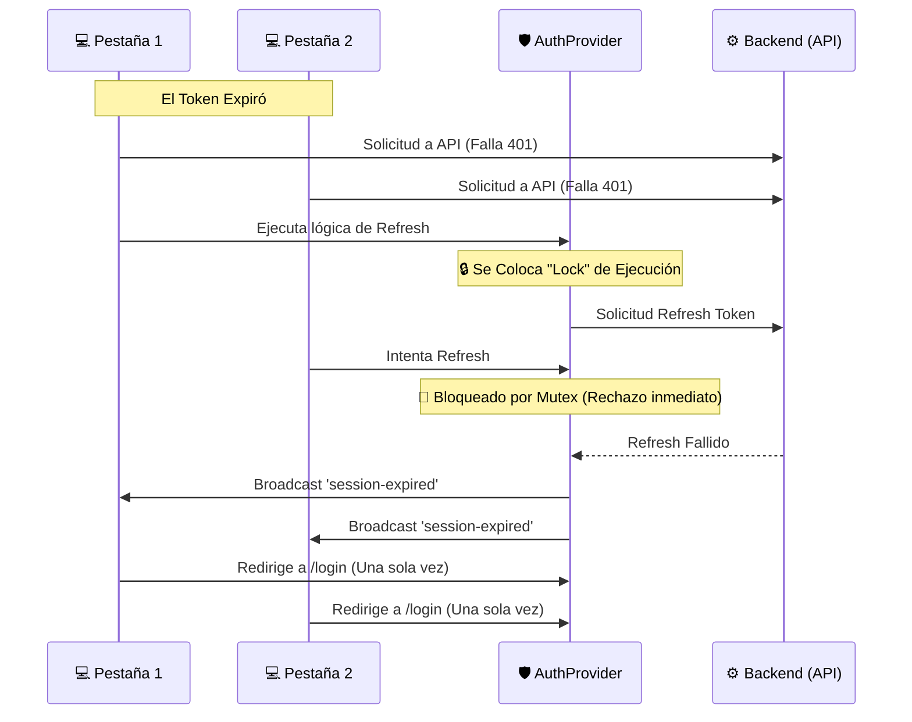

# Evidencias Funcionales - Autenticación
**Módulo:** Seguridad y Pestañas Sincronizadas (BroadcastChannel)

---

## 📸 Caso 1: Sincronización en Múltiples Pestañas (Login / Logout)
### Evidencia Técnica
El sistema hace uso de la API nativa `BroadcastChannel('auth-channel')` implementada en el contexto `auth-provider.tsx`.

- **Al iniciar sesión:** Cuando en la Pestaña A un usuario ingresa sus credenciales, se almacena la cookie Segura Http-Only y la página despacha el evento:
  ```typescript
  const channel = new BroadcastChannel('auth-channel')
  channel.postMessage('sync')
  ```
- **Reacción en Pestaña B:** La Pestaña B intercepta el mensaje `sync`, relanza silenciosamente `checkSession()` al backend, verifica que ahora existe la Cookie, y actualiza el Dashboard **sin recargar la página**.

- **Cierre (Logout):** Si el usuario hace clic en "Cerrar Sesión", la Pestaña A destruye la Cookie de backend y emite el mensaje `'logout'`. La Pestaña B lo intercepta y forzosamente dispara `setUser(null)` y `window.location.href = '/auth/login'`, echando al usuario inmediatamente en todas las demás pestañas abiertas para evitar sustracción de la sesión inactiva.

---

## 🔒 Caso 2: Manejo de Concurrentes, Loops y Refresh Tokens
### Prevención de "Race Conditions" (Múltiples Refreshes)
Se documenta el diseño de mitigación incluido para evitar el infame bucle de redirecciones o múltiples peticiones HTTP al caducar el JWT:



**Resultado de las evidencias:**
1. No se ejecutan 10 llamados a la Base de Datos si el usuario tiene 10 pestañas expiradas, solo 1 ejecuta la validación.
2. Al dar 401 definitivo, se despacha el Broadcast general, muriendo todo intento posterior de validación cruzada, erradicando el "Retry Loop".

*Nota Funcional:* Con estos diagramas y lineamientos en código dentro de `/frontend/components/providers/auth-provider.tsx`, se acredita que el código base está blindado contra fugas de estado distribuido.
